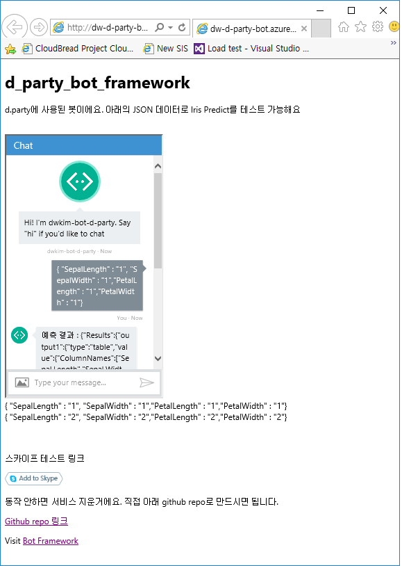
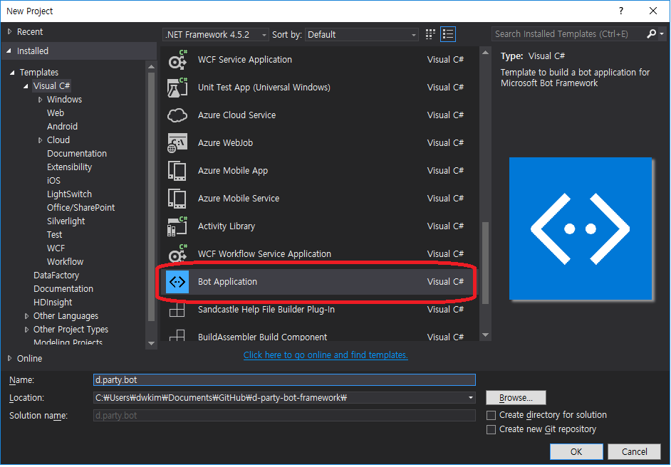
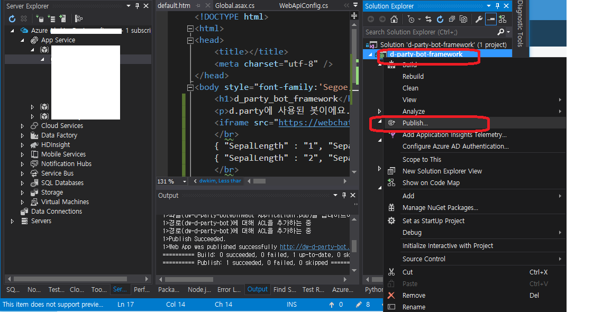
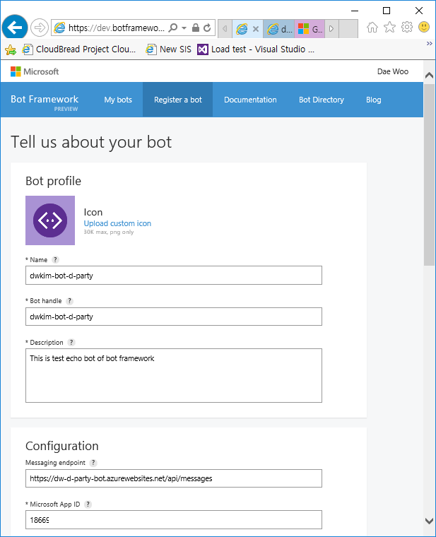
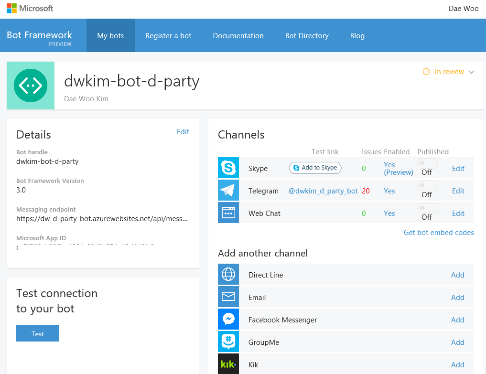
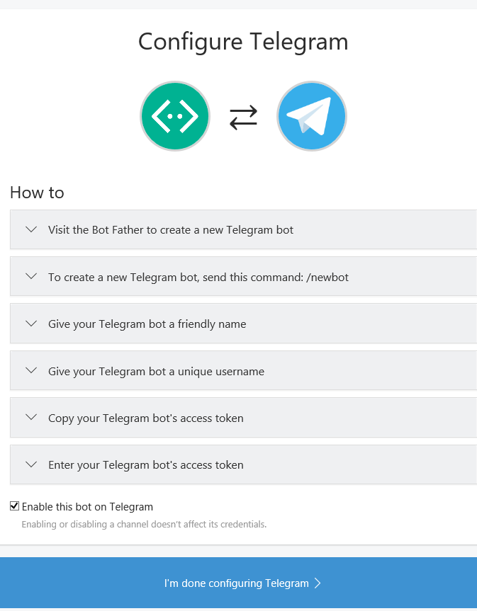
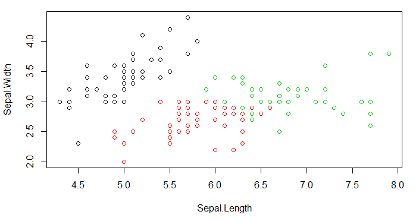
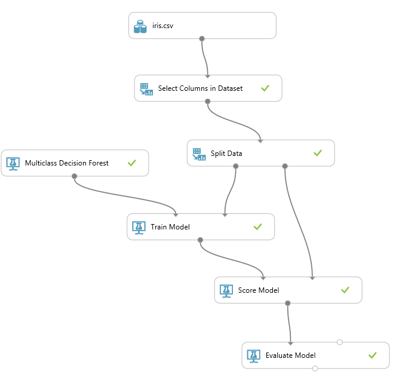
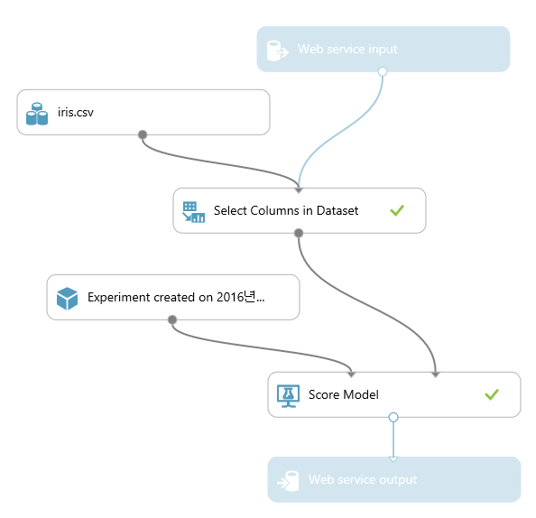
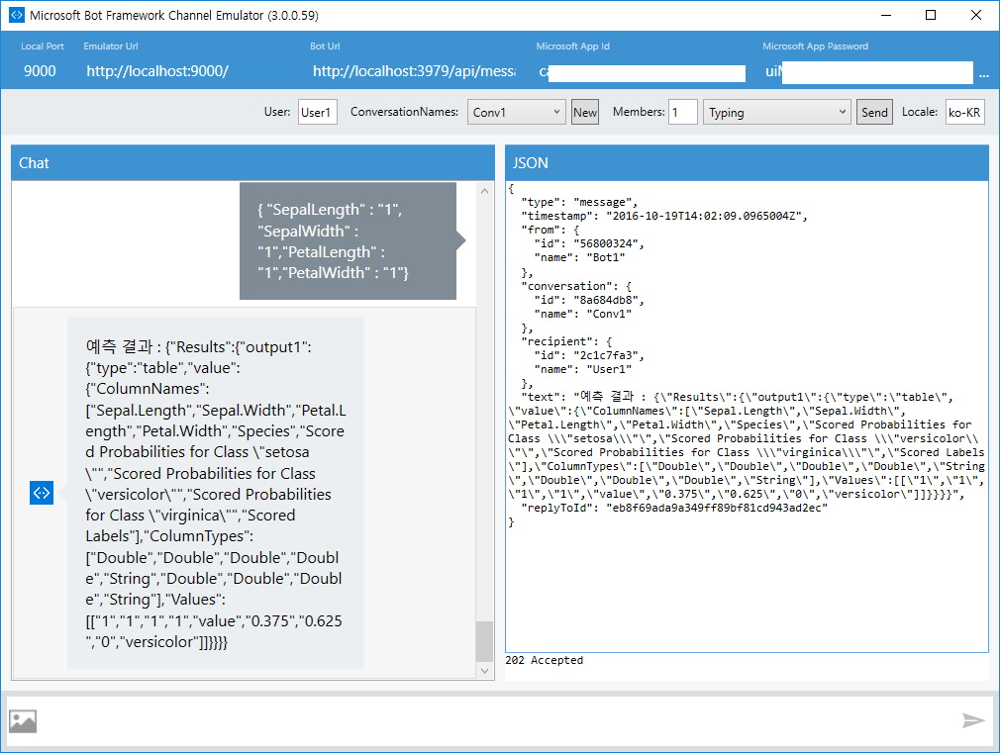

# 마이크로소프트 봇 프레임워크로 만드는 인공지능 봇
Microsoft Bot fraemwork code for D.Camp - d.party presentation  
이 자료는 d.party 발표를 위해 제작. http://www.dcamp.kr/event/apply/1500  

### 10분 동안 만드는 진짜 Bot
Microsoft Bot Framework를 이용해  
봇을 개발 / 게시 / 등록하고, 실제 메신져 어플리케이션에서 추가해 봇과 채팅하는 어플리케이션을 개발하는 것이 목표 + Azure Machine Learning을 이용해 예측 분석을 봇을 통해 수행  

###Bot 테스트 링크
아래 경로에서 실제 d.party에 사용된 웹봇을 테스트 가능  
#### Web link : [Iris predict 웹봇](http://dw-d-party-bot.azurewebsites.net/)  
  

skype가 있다면 아래 링크에서 테스트 가능  
#### 스카이프 link : [](https://join.skype.com/bot/ca7f502d-335b-4891-9343-674e42d812b6)

### 전체 진행 절차
Microsoft Bot Framework를 이용해 실제 봇을 개발하는 절차  
https://docs.botframework.com/en-us/csharp/builder/sdkreference/gettingstarted.html  
- Node.js 또는 .NET을 이용해 프로젝트 시작
- .NET 과정일 경우 Bot Framework 템플릿을 이용해 진행
  
- 봇 에뮬레이터로 테스트(Microsoft Bot Framework Channel Emulator)
  
- 개발 과정을 수행 (코드 참조)
- Microsoft Azure - PaaS, App Service의 API App으로 publish 수행
  
- 봇을 Microsoft Bot Framework에 "등록"
  
- 등록한 봇을 테스트
  
generate된 MicrosoftAppId와 MicrosoftAppPassword를 web.config의 코드에 추가
```
<!-- update these with your BotId, Microsoft App Id and your Microsoft App Password-->
<add key="BotId" value="dwkim-bot-d-party" />
<add key="MicrosoftAppId" value="AppID" />
<add key="MicrosoftAppPassword" value="AppPWD" />
```
- 채널 설정 및 다른 메신저(Facebook Messenger, Skype, Slack, Telegram 등)와 통합
  
- Azure Machine Learning의 Predictive Model로 예측 분석 수행
Iris 데이터로 처리 : github repo의 Iris 폴더 참조  
  
- Iris 학습 모델 생성
  
- Iris 예측 모델 생성
  
- 코드 통합 후 Microsoft Bot Framework Channel Emulator에서 prediction 수행
  
- 테스트 후 Azure API App으로 배포

## d.party 발표자료 slideshare  
slide share 링크 :  

## 사용한 코드 정보
https://github.com/CloudBreadPaPa/d-party-bot-framework 리포지토리 하위의 d-party-bot-framework 폴더에 모든 코드 포함  
web.config 파일의 아래 내역 수정 필요  
```
<!-- update these with your BotId, Microsoft App Id and your Microsoft App Password-->
<add key="BotId" value="dwkim-bot-d-party" />
<add key="MicrosoftAppId" value="AppID" />
<add key="MicrosoftAppPassword" value="AppPWD" />
```
Controller\MessageColtroller.cs 파일에서 아래 내역 수정 필요  
```
...
const string apiKey = "Azure ML API 키"; // Azure ML 접근을 위한 키값  
...
client.BaseAddress = new Uri("Azure ML API URL");  
...
```
